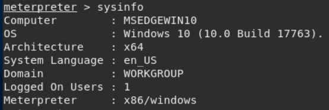

## GoodSecurity Penetration Test Report

Date: 4/23/2022  
UoT Cybersecurity Bootcamp 2022 
G-Mully
([g-mully@GoodSecurity.com](mailto:g-mully@GoodSecurity.com))

 

### High-Level Summary
---
GoodSecurity was tasked with performing an internal penetration test on GoodCorps CEO, Hans Gruber. An internal penetration test is a dedicated attack against internally connected systems. The focus of this test is to perform attacks, similar to those of a hacker and attempt to infiltrate Hans computer and determine if it is at risk. GoodSecurity's overall objective was to exploit any vulnerable software and find the secret recipe file on Hans' computer, while reporting the findings back to GoodCorp.

When performing the internal penetration test, there were several alarming vulnerabilities that were identified on Hans' desktop. When performing the attacks, GoodSecurity was able to gain access to his machine and find the secret recipe file by exploiting two programs that had major vulnerabilities. The details of the attack can be found in the Findings category.

---

### Finding 1
Machine IP: 129.168.0.20 
Hostname: MSEDGEWIN10 
Vulnerability Exploited: 
- exploit/windows/http/icecast_header 
- Port 8000/tcp open - Icecast streaming media server

<b>Vulnerability Explanation:</b>
Icecast is an audio broadcast system that streams music in both MP3 and
Ogg Vorbis format. The Icecast server accepts a maximum of 32 headers in the clients HTTP request.

In some environments (like in Win32) a request with more than 31 headers causes the overwriting of the return address of the vulnerable function with a pointer to the beginning of the 32th header.

In short, is possible to execute remote code simply using the normal
HTTP request plus 31 headers followed by a shellcode that will be
executed directly without the need of calling/jumping to registers or
addresses or using other annoying techniques.

 

Severity: 
CVSS Score - 7.5 (HIGH)

| Area Impact     | Severity | Outcome                                                                                                                                                                                   |
|-----------------|----------|-------------------------------------------------------------------------------------------------------------------------------------------------------------------------------------------|
| Confidentiality | Partial  | There is considerable informational disclosure                                                                                                                                            |
| Integrity       | Partial  | Modification of some system files or information is possible, but the  attacker does not have control over what can be modified, or the scope  of what the attacker can affect is limited |
| Availability    | Partial  | There is reduced performance or interruptions in resource availability                                                                                                                    |                                        
---
### Finding 2
Machine IP: 129.168.0.20 
Hostname: MSEDGEWIN10 
Vulnerability Exploited: 
- exploit/windows/local/ikeext_service 

<b>Vulnerability Explanation:</b>
This vulnerability could allow an attacker to execute malicious code on a target system by sending specially crafted network packets. If the targeted server utilises the HTTP Protocol Stack (http.sys) to process these packets, an attacker can execute malicious code on the machine without having any authentication or user interaction required.

Since this is a service running with higher privileges than a normal user this bug is wormable as well.

Attacks will probably mostly be aimed at Windows Servers but Windows 10/11 are potentially vulnerable to this as well depending on the configuration so make sure to check your endpoints as well as your servers.

 

Severity: 
CVSS Score - 9.3 (CRITICAL)
| Area Impact       | Severity | Outcome                                                                                                                                           |
|-------------------|----------|---------------------------------------------------------------------------------------------------------------------------------------------------|
| Confidentiality   | Complete | There is total information disclosure, resulting in all system files being revealed                                                               |
| Integrity         | Complete | There is a total compromise of system integrity. There is a complete loss of system  protection, resulting in the entire system being compromised |
| Availability      | Complete | There is a total shutdown of the affected resource. The attacker can render the  resource completely unavailable.                                 |
| Access Complexity | Medium   | The access conditions are somewhat specialized. Some preconditions must be satisfied  to exploit                                                  |
---

### Finding 3
Machine IP: 129.168.0.20 
Hostname: MSEDGEWIN10 
Vulnerability Exploited: 
- exploit/windows/local/ms16_075_reflection 

<b>Vulnerability Explanation:</b>
An elevation of privilege vulnerability exists in the Microsoft Server Message Block (SMB) when an attacker forwards an authentication request intended for another service running on the same machine. An attacker who successfully exploited this vulnerability could execute arbitrary code with elevated permissions.

To exploit the vulnerability, an attacker would first have to log on to the system. An attacker could then run a specially crafted application that could exploit the vulnerability and take control of an affected system. The update addresses the vulnerability by correcting how Windows Server Message Block (SMB) Server handles credential forwarding requests.

 

Severity:
CVSS Score - 6.9 (HIGH)
| Area Impact       | Severity | Outcome                                                                                                                                           |
|-------------------|----------|---------------------------------------------------------------------------------------------------------------------------------------------------|
| Confidentiality   | Complete | There is total information disclosure, resulting in all system files being revealed                                                               |
| Integrity         | Complete | There is a total compromise of system integrity. There is a complete loss of system  protection, resulting in the entire system being compromised |
| Availability      | Complete | There is a total shutdown of the affected resource. The attacker can render the  resource completely unavailable.                                 |
| Access Complexity | Medium   | The access conditions are somewhat specialized. Some preconditions must be satisfied  to exploit                                                  |        

---

 

## Proof of Concept:

To better explain the findings we will show how we went about getting our results.  With full access to the network we decided to begin with network scan to see what ports were open on the CEO's workstation.

As we can see here one of the open ports & exploits is Icecast on port 8000. Lets see if there are any exploits for Icecast

As we can see there are more than half a dozen exploits.  Let's move into our Metasploit console and see what exact exploits there are available

Searching for Icecast exploits brings up only one exploit.

So with the one exploit lets launch and setup the Icecast exploit.

Now that we are in lets setup the exploit to target the CEO's machine.

With that setup we can now launch the exploit.

The exploit is successful and has tunnled in.  We now have a full meterpreter session running on the CEO's machine. From here we can perform mutiple searches to locate and display confidential PII.  Here are some of the files we found.

Now that we have found the files lets see what is inside of them.

We can even download the information over to our Kali VM if we so choose to do so.

Continuing on with the findings, regarding the other expliots we ran our suggester to see what other exploits your machine was vulnerable to.

And as talked about there are the two other exploits that are present on the CEO's machine that are discussed in findings 2 & 3 up above.

  
Other actions we were able to take included: 

- opening a direct C:\ prompt shell
- gathering the system information
- finding out what users are logged on currently

 

---
